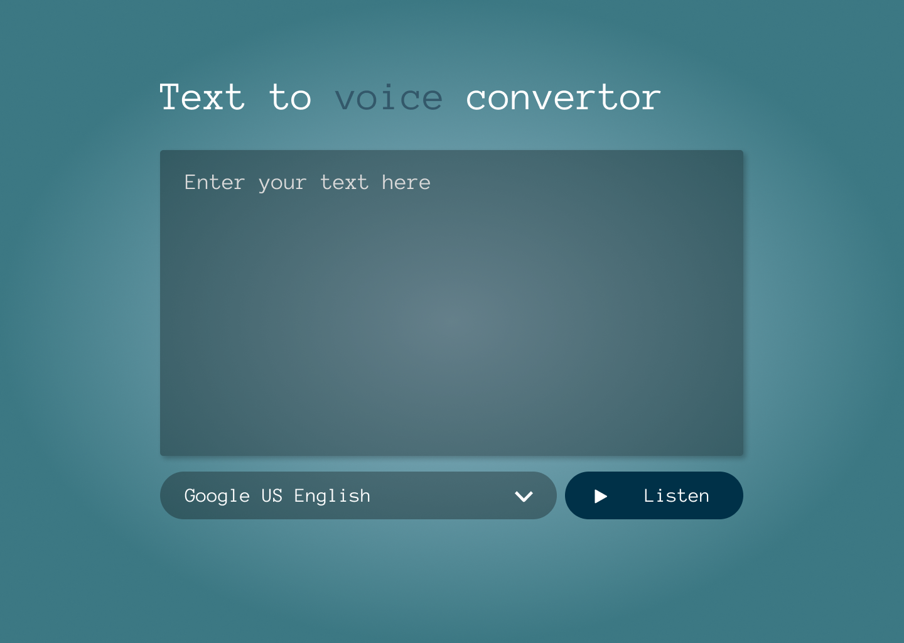

# Multi-Language Text-to-Speech Web App  

This is a web application that converts entered text into speech in different languages. Built using **HTML, CSS, JavaScript**, and designed with **Figma**.

## 🚀 Features  
- 🎙️ Converts text to speech in multiple languages  
- 🌍 Supports various voice options  
- 📱 Simple and responsive UI  

## 🛠️ Technologies Used  
- **Frontend**: HTML, CSS, JavaScript  
- **Design**: Figma  
- **API**: Web Speech API (SpeechSynthesis)  

## 📸 Screenshots  
 

## Live Demo  
[**View the Live Project**](https://dark1arrow.github.io/Chat-Voice-Convertor/)  

## Figma Design  
[**View Figma Design**](https://www.figma.com/design/rervNKegOt7yXEDeSnH9UC/java-script-project?node-id=174-3&t=OifU2ALxCPA6Z7v9-1)  

## LinkedIn 
[**Check LinkedIn**](https://www.linkedin.com/in/gouatm-khanna-61ba63262/?utm_source=share&utm_campaign=share_via&utm_content=profile&utm_medium=android_app)
  